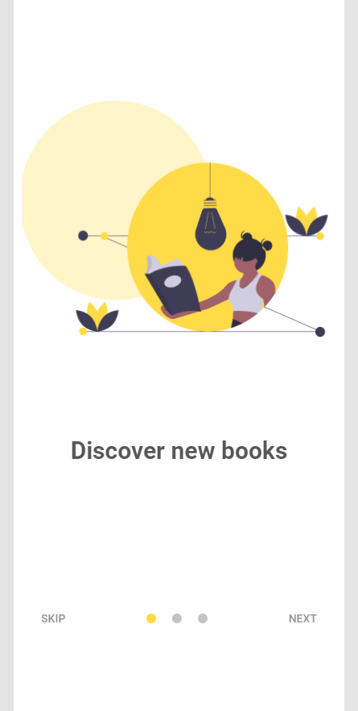
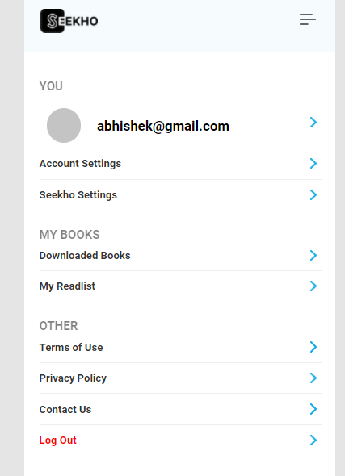
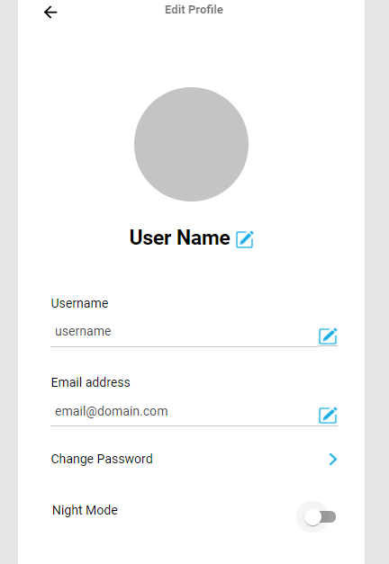
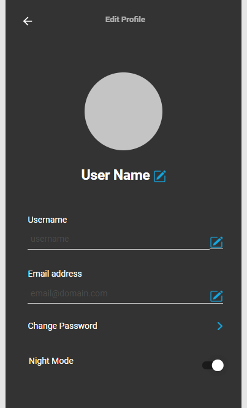
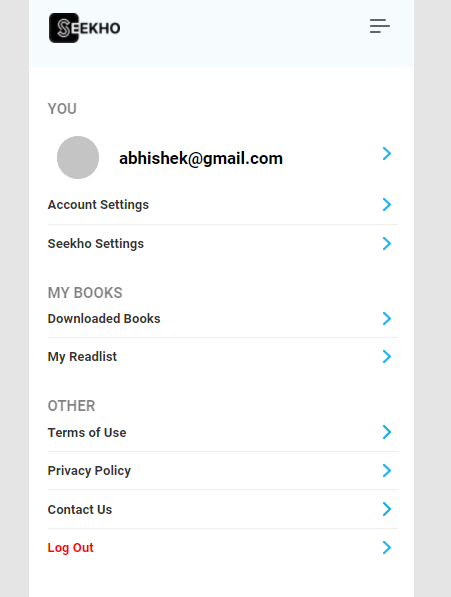

# seekho-project

Seekho is a free ebook library with books ranging from fiction, and non-fiction to academic books for school and college students.

## Features

- Read Books By Categories
- Add Books to Read Later
- Download books
- Sign in / Sign up with Mail,Google and Facebook

## Tech Stacks

#### **Frontend**

- [reactjs](https://reactjs.org/)

#### **Backend**

- [Mongodb](https://www.mongodb.com/)
- [Expressjs](https://expressjs.com/)
- [Nodejs](https://nodejs.org/en/)

##### **Fetch data**

- [Axios](https://www.npmjs.com/package/axios)

#### **Styles**

- [Material UI](https://mui.com/)
- [Style-Components](https://styled-components.com/)

#### **Encryptation and Password Privacy**

- [bcrypt](https://www.npmjs.com/package/bcrypt)
- [Google oAuth](https://developers.google.com/identity/protocols/oauth2)
- [uuid](https://www.npmjs.com/package/uuid)

# _Getting Started_

These instructions will get you a copy of the project up and running on your local machine for development and testing purposes.

## Install

Follow the following steps to get development environment running.

1. Clone 'Seekho-Project' repository from GitHub

   ```bash
   git clone https://github.com/vcow10kar/seekho-project.git
   ```

   _or using ssh_

   ```bash
   git clone git@github.com:vcow10kar/seekho-project.git
   ```

1. Install node modules

- Client

  ```bash
  cd client
  ```

  ```bash
  npm install

  or

  npm i
  ```

- Server

```bash
cd server
```

```bash
npm install

or

npm i
```

- Need to Add .env File with Relevent Environment Variable

### **_Run the project_**

- open two terminal one for client and one for Server after that run this command

  - client

  ```bash
  npm start
  ```

  - server

  ```bash
  npm run server
  ```

  ## _Blog of This Project(Know more about the project)_

  [Medium](https://medium.com/@yashgarg1402/d862f088083e)

<br/>

## **_Snapshots of the Project_**

- after running the project first screen apper on the website
  

  <br/>

- Sign In and Sign Up Page With Google and Facebook Sign Option with Skip Optaion , if you not want to sign in only visit to website you can use Skip button below
  

  <br/>

  - Home Page along with Navbar and Footer and also show which user start reading

    

<br/>

- Explore page has all the according to book section such as [Contemporrary](https://www.google.com/search?sxsrf=AOaemvJ-QyJqd48vwgAsMipcTe2OwMzOWQ:1636798512792&q=contemporary+book+meaning&spell=1&sa=X&ved=2ahUKEwivrbHPjZX0AhXGbSsKHQ_KCpcQirwEKAB6BQgBENcB&biw=1536&bih=718&dpr=1.25) , [Self Help](https://en.wikipedia.org/wiki/Self-help_book) , [Thriller](<https://en.wikipedia.org/wiki/Thriller_(genre)>) etc...

    

  <br/>

- user page which has all the information of the user
  
  <br/>

- User Profile Edit Option with Night Mode Option
  

  - Night Mode

    

  <br/>
  - User Profile Detail

    

# Contributors

- **Abhishek Ranjan** [AbhishekRanjan8051](https://github.com/AbhishekRanjan8051)
- **Vaishnavi Kawthankar** [vcom10kar](https://github.com/vcow10kar)
- **Prashanth Dyavanapally** [Prashanth2856](https://github.com/Prashanth2856)
- **Vishal Rathod** [Vishal-080](https://github.com/Vishal-080)
- **Yash Garg** [yash-ga](https://github.com/yash-ga)
